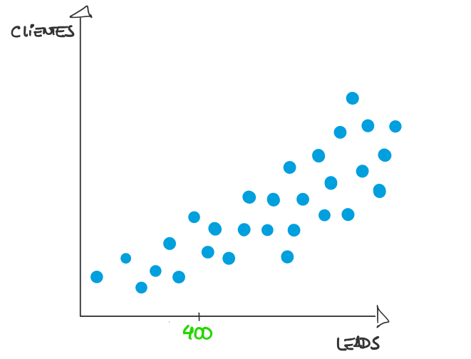
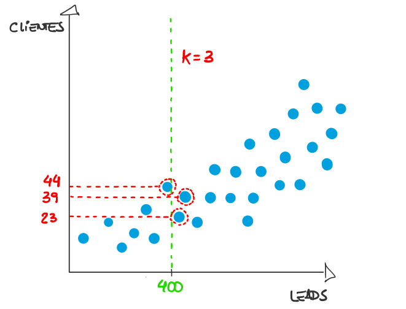
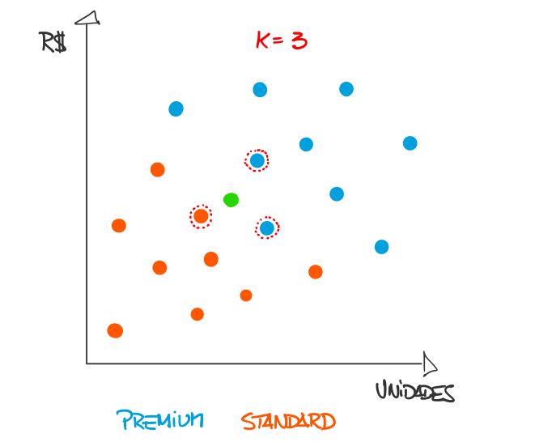

```{r setup, include=FALSE}
knitr::opts_chunk$set(echo = TRUE, error = TRUE)
```

# Introdução

O Kaggle, de forma resumida, é uma plataforma que hospeda competições de ciência de dados, famosa entre profissionais e entusiastas da área. Entre as diversas competições disponíveis ao público, o desafio do Titanic provavelmente seja o mais popular entre os iniciantes no mundo dos dados.

A competição funciona da seguinte forma: o Kaggle fornece os dados sobre os passageiros do RMS Titanic, o famoso transatlântico britânico naufragado em 1912. Entre dados como sexo, preço da tarifa, porto de embarque e etc., há uma variável que indica se o passageiro sobreviveu ou não ao naufrágio. No entanto, parte dos passageiros não possui tal informação e a partir daí o competidor entra em ação através de uma análise preditiva para tentar adivinhar quais passageiros sobreviveram ao desastre.

A proposta deste artigo é apresentar aos <s>marinheiros</s> cientistas de dados de primeira viagem um tutorial, através da linguagem R, no processo de exploração e preparação dos dados, incluindo a criação de novas variáveis e a imputação de dados ausentes, de modo que ao término tenhamos um conjunto de dados em formato adequado para modelagem preditiva.

# Pacotes e funções de apoio

Todo o processo analítico proposto será realizado através do R e para isto vamos precisar utilizar as seguintes bibliotecas:

```{r, message=FALSE}
require(tidyverse)
require(kableExtra)
require(fastDummies)
require(caret)
require(MASS)
```

Criaremos algumas funções de apoio para evitar a repetição de código:

```{r}
GG_COLOR <- "#1da4d1"

# Quantifica os valores missing
count_missing_values <- function(df) {
  df <- as.data.frame(df)
  n_df <- nrow(df)
  out <- data.frame(var = names(df))
  out$n_missing <- NA
  out$f_missing <- NA
  out$var <- as.character(out$var)
  for (i in 1:nrow(out)) {
    var_name <- out[i,1]
    out$n_missing[i] <- length(df[is.na(df[var_name]),1])
    out$f_missing[i] <- round(out$n_missing[i] / n_df,4)
  }
  out <- out %>%
    arrange(desc(n_missing))
  
  return(out)
}


# Função head customizada
custom_head <- function(df, rows=6) {
  head(df, rows) %>%
    kable() %>%
    kable_styling(bootstrap_options = c("striped", "hover", "condensed", "responsive"), full_width = F)
}


# Gráfico de barras customizado
custom_barPlot <- function(df, var_x, lab_x=var_x, lab_y="Freq", title="", log=NULL, angle_x=NULL) {
  plt <- df %>%
    ggplot(aes_string(x = var_x)) +
    geom_bar(fill = GG_COLOR, alpha = 0.7) +
    labs(x = lab_x, y = lab_y, title = title) +
    theme_bw()
  
  if(!is.null(log)) {
    plt <- plt + scale_y_log10()
  }
  
  if(!is.null(angle_x)) {
    plt <- plt + theme(axis.text.x = element_text(angle = angle_x, hjust = 1, vjust = 0.5))
  }
  
  return(plt)
}


# Gráfico de colunas customizado
custom_colPlot <- function(df, var_x, var_filter, criteria, lab_x=var_x, lab_y="Freq", title="") {
  tb <- as.data.frame(prop.table(table(df[[var_filter]], df[[var_x]]),2))
  names(tb) <- c(var_filter, var_x, "Freq")
  tb <- tb[tb[[var_filter]] == criteria,]
  
  plt <- ggplot(tb, aes_string(x = var_x, y = "Freq")) +
    geom_col(fill = GG_COLOR, alpha = 0.7) +
    labs(x = lab_x, y = lab_y, title = title) +
    theme_bw()
  
  return(plt)
}


# Boxplot customizado
custom_boxPlot <- function(df, var_x, lab_x=var_x, var_y, lab_y=var_y, title="", y_lim=NULL) {
  df <- df[!is.na(df[,var_x]), ]
  df[, var_x] <- as.factor(df[, var_x])
  
  plt <- ggplot(df, aes_string(x = var_x, y = var_y)) +
    geom_boxplot(fill = GG_COLOR, alpha = 0.7) + 
    labs(x = lab_x, y = lab_y, title = title) +
    theme_bw()
  
  if(!is.null(y_lim)) {
    plt <- plt + coord_cartesian(ylim = c(0,y_lim))
  }
  
  return(plt)
}
```

## Conjuntos de dados

A competição do Titanic disponibiliza 3 arquivos e para fazer o download é necessário criar uma conta no [Kaggle](https://www.kaggle.com/) primeiro e depois acessar a competição [Titanic: Machine Learning from Disaster](https://www.kaggle.com/c/titanic).

O arquivo <b>train.csv</b> corresponde aos dados de 891 passageiros e deve ser utilizado para o treinamento do modelo. Já o <b>test.csv</b> refere-se aos dados de 418 passageiros, porém não contém a informação se o passageiro sobreviveu ou não ao naufrágio. Por fim, o <b>gender_submission.csv</b> é o modelo de arquivo que deve ser submetido na plafaforma com as predições dos 418 passageiros, mas como este artigo não irá abordar a modelagem preditiva, podemos ignorá-lo.

Efetuado o download dos datasets, podemos carregá-los:

```{r}
df_train <- read.csv("../data/train.csv", na.strings = c("", NA), encoding = "UTF-8")

df_test <- read.csv("../Data/test.csv", na.strings = c("", NA), encoding = "UTF-8")
```

Em seguida unificamos os arquivos para facilitar as etapas seguintes:

```{r}
df_all <- df_train %>%
  bind_rows(df_test)
```

# Explorando e preparando os dados

Nesta etapa o objetivo é entender o que os dados dizem, bem como identificar e corrigir inconsistências, lidar com dados ausentes (NAs) e criar novas variáveis. É a etapa mais demorada e mais importante do processo analítico.

## Primeiras impressões

Não podemos iniciar sem antes verificar o dicionário de dados disponível na [página do desafio](https://www.kaggle.com/c/titanic/data):

```{r, echo=FALSE}
Variavel <- names(df_all)
Definicao <- c("Código de identificação",
               "Sobrevivência",
               "Classe de embarque",
               "Nome",
               "Sexo",
               "Idade em anos",
               "Qtd. de irmãos/cônjuges a bordo",
               "Qtd. de pais/filhos a bordo",
               "Número da passagem",
               "Preço da passagem",
               "Número da cabine",
               "Porto de embarque")
Observacao <- c("",
                "0 = não, 1 = sim",
                "1 = 1°, 2 = 2°, 3 = 3°",
                "",
                "female = feminino, male = masculino",
                "",
                "",
                "",
                "",
                "",
                "",
                "C = Cherbourg, Q = Queenstown, S = Southampton")

dicionario <- data.frame(Variavel, Definicao, Observacao)
```

```{r, echo=FALSE}
custom_head(dicionario, 12)
```

Agora uma visão geral na estrutura do dataset:

```{r}
str(df_all)
```

Aqui podemos identificar, por exemplo, que o dataset possui 1309 observações e 12 variáveis e que ele é composto por dados numéricos e do tipo texto. 

Observamos no dicionário de dados que as variáveis <b>Survived</b>, <b>Pclass</b>, <b>Sex</b> e <b>Embarked</b> são categóricas, portanto, predcisamos convertê-las para o formato <i>factor</i>:

```{r}
df_all <- df_all %>%
  mutate_at(c("Pclass", "Embarked", "Sex", "Survived"), factor)
```

Vamos dar uma olhada nas primeiras observações do conjunto de dados:

```{r}
custom_head(df_all)
```

Observamos as primeiras linhas do dataset em formato tabular para termos uma idéia de como os campos estão preenchidos. Um detalhe que chamou a atenção é a variável <b>Name</b>, que além de nome e sobrenome, possui também o título do passageiro. Podemos, posteriormente, tentar criar uma nova variável com o título do passageiro. Vamos deixar esta informação "anotada" para trabalharmos com ela mais adiante.

Será que existem dados dados ausentes (NA)? Aqui utilizaremos duas funções personalizadas que criamos no início do artigo. A função <code>count_missing_values()</code> retorna as frequências de dados faltantes em cada variável e a função <code>custom_head()</code> serve apenas para plotar uma tabela mais bonita.

```{r}
df_all %>%
  count_missing_values() %>%
  custom_head(12)
```

Podemos observar que as variáveis <b>Cabin</b>, <b>Survived</b>, <b>Age</b>, <b>Embarked</b> e <b>Fare</b> possuem valores faltantes. Com exceção da variável <b>Survived</b>, que já era esperada a ausência em 418 observações, para as demais teremos que definir, posteriormente, uma estratégia para lidar com as ausências.

Agora vamos verificar algumas estatísticas do conjunto de dados:

```{r}
df_all %>%
  summary() %>%
  custom_head(7)
```

Podemos observar, por exemplo, que os passageiros embarcaram predominantemente na terceira classe, através do porto de Southampton e que a maioria era do sexo masculino. A idade média dos passageiros era de 29 anos, variando de 0 a 80 e a tarifa média paga foi de 33 unidades monetárias, variando de 0 a 512, entretanto, dada a discrepância da média com relação à mediana, percebemos forte existência de outliers nesta variável.

## Sexo

Vamos iniciar a exploração da variável <b>Sex</b> verficando as frequências através da função personalizada <code>custom_barPlot()</code>:

```{r}
custom_barPlot(df = df_all, 
               var_x = "Sex", 
               lab_x = "Sexo", 
               lab_y = "Passageiros", 
               title = "Passageiros por sexo")
```

A forma gráfica nos permite ter maior noção da predominância dos passageiros do sexo masculino.

Podemos ver também, através da função personalizada <code>custom_colPlot</code>, o comportamento da variável <b>Survived</b> com relação ao sexo dos passageiros:

```{r}
custom_colPlot(df = df_all, 
               var_x = "Sex", 
               var_filter = "Survived", 
               criteria = 1, 
               lab_x = "Sexo", 
               lab_y = "Sobreviventes", 
               title = "Taxa de Sobreviventes por sexo")
```

Este gráfico deixa evidente que a proporção de mulheres sobreviventes é significantemente superior a dos homens.

## Classe de embarque

Iniciaremos a exploração da variável <b>Pclass</b> novamente através das frequências: 

```{r}
custom_barPlot(df = df_all, 
               var_x = "Pclass", 
               lab_x = "Classe", 
               lab_y = "Passageiros", 
               title = "Passageiros por classe")
```

Aqui percebemos que a quantidade de passageiros embarcados na terceira classe equivale aproximadamente ao total de passageiros embarcados nas demais. 

Vamos agora verificar como a sobreviência dos passageiros se comporta com relação à classe de embarque:

```{r}
custom_colPlot(df = df_all, 
               var_x = "Pclass", 
               var_filter = "Survived", 
               criteria = 1, 
               lab_x = "Classe", 
               lab_y = "Sobreviventes", 
               title = "Taxa de Sobreviventes por Classe")
```

Nota-se que na terceira classe a taxa de sobrevivência foi menor que 25%, ao passo que na primeira, mais de 60% dos passageiros sobreviveram. Será que tem alguma relação com o sexo dos passageiros?

```{r}
round(prop.table(table(df_all$Sex, df_all$Pclass), 2), 2) %>%
  custom_head()
```

Observamos que a primeira classe possui a maior proporção de mulheres quando comparada às demais. Inclusive parece haver uma correlação positiva entre a proporção de mulheres e a taxa de sobreviventes.

## Tamanho da família

Será que o tamanho da família à bordo teve alguma influência na sobrevivência dos passageiros? Através das variáveis <b>SibSp</b> e <b>Parch</b> criaremos a variável <b>Family_size</b> para facilitar a análise deste comportamento.

```{r}
df_all$Family_size <- with(df_all, Parch + SibSp + 1)
```

Verificamos agora as frequências:

```{r}
custom_barPlot(df = df_all, 
               var_x = "Family_size", 
               lab_x = "Tamanho da família", 
               lab_y = "Passageiros", 
               title = "Passageiros por Tamanho de Família")
```

Aqui observamos forte predominância dos passageiros que embarcaram sozinho, bem como a baixa ocorrência de familias com mais de 4 membros.

```{r}
custom_colPlot(df = df_all, 
               var_x = "Family_size", 
               var_filter = "Survived", 
               criteria = 1, 
               lab_x = "Tamanho da Família", 
               lab_y = "Sobreviventes", 
               title = "Taxa de sobreviventes por Tamanho de Família")

```

Neste gráfico parece que os passageiros integrantes de famílias compostas por até 4 pessoas obtiveram maior sucesso na sobrevivência em relação aos demais. No entanto, neste grupo de até 4 membros familiares, os passageiros que embaracam sozinho apresentam a menor taxa de sobrevivência.

## Título

Por meio de uma <b>expressão regular</b> vamos extrair o título do passageiros, presente na variável <b>Name</b>, e atribuí-los a uma nova variável chamada <b>Title</b>:

```{r}
df_all$Title <- df_all$Name %>%
  str_extract("([A-z]+)\\.") %>%
  str_sub(end = -2)
```

Será que deu certo?

```{r}
df_all[,c('Name', 'Title')] %>%
  custom_head()
```

Parece que sim. Agora vamos verificar as frequências:

```{r}
custom_barPlot(df = df_all,
               var_x = "Title",
               lab_x = "Título",
               lab_y = "Passageiros",
               title = "Passageiros por título",
               angle_x = 90)
```

Chama a atenção a predominância de títulos com baixa frequência, mas podemos tentar agrupá-los.

Começando pelos títulos femininos, <b>Mlle</b> é a versão francesa de <b>Miss</b>, que é aplicado a mulheres solteiras, ao passo que <b>Mme</b>, também francês e equivalente a <b>Mrs</b>, é aplicado a mulheres casadas. Quanto ao título <b>Ms</b>, que não indica estado civil, devido à baixa ocorrência seria interessante agrupá-lo em alguma categoria mais frequente.

```{r}
custom_head(df_all %>%
  filter(Title == "Ms"))
```

Percebemos que há apenas duas passageiras com o título <b>Ms</b> e elas não possuem familiares à bordo, portanto, não seria nenhum absurdo supormos que se trata de duas mulheres solteiras. Assim sendo, podemos substituir pelo título <b>Miss</b>. 

Já os títulos <b>Capt</b> e <b>Col</b> correspondem a <b>Capitão</b> e <b>Coronel</b>, respectivamente. Portanto, juntamente com <b>Major</b>, podemos agrupá-los em uma categoria militar.

Por fim, os títulos <b>Countess</b>, <b>Don</b>, <b>Dona</b>, <b>Lady</b>, <b>Sir</b> e <b>Jonkheer</b> (algo como young lord na Holanda) podem ser agrupados como títulos de nobreza.

Sendo assim, vamos fazer todas as substituições. Inicialmente criaremos uma função para efetuar a conversão dos títulos, baseado na análise que acabamos de realizar:

```{r}
group_titles <- function(title) {
  out <- title
  if(title %in% c("Mlle", "Ms")) {
    out <- "Miss"
  } else if(title == "Mme") {
    out <- "Mrs"
  } else if(title %in% c("Capt", "Col", "Major")) {
    out <- "Military"
  } else if(title %in% c("Countess", "Don", "Dona", "Lady", "Sir", "Jonkheer")) {
    out <- "Nobility"
  }
  return(out)
}
```

Em seguida, através da função <code>sapply()</code>, efetuaremos as transformações no dataset:

```{r}
df_all$Title <- sapply(df_all$Title, group_titles)
```

Vamos ver como ficaram as frequências:

```{r}
custom_barPlot(df = df_all,
               var_x = "Title",
               lab_x = "Título",
               lab_y = "Passageiros",
               title = "Passageiros por título (escala logaritmica)",
               angle_x = 90,
               log = T)
```

Agora vamos analisar a relação do título com a taxa de sobrevivência dos passageiros:

```{r}
custom_colPlot(df = df_all,
               var_x = "Title",
               var_filter = "Survived",
               criteria = 1,
               lab_x = "Título",
               lab_y = "Sobreviventes",
               title = "Taxa de sobreviventes por título")
```

Podemos observar que os títulos feminínos (Miss e Mrs) possuem as maiores taxas de sobrevivência, ao passo que o título masculino <b>Mr</b>, disparadamente, possui a menor taxa. Os títulos de nobreza e o título <b>Master</b> também possuem taxa de sobrevivência relativamente altas.

```{r, message=FALSE}
df_all %>%
  filter(!is.na(Age)) %>%
  group_by(Title) %>%
  summarise(avg_age = mean(Age), min_age = min(Age), max_age = max(Age)) %>%
  custom_head()
```

Quem assistiu o filme [Titanic](http://www.adorocinema.com/filmes/filme-5818/) é provável lembrar que mulheres e crianças tiveram preferência na evacuação do navio, e, analisando os passageiros com o título <b>Master</b>, percebemos que o intervalo da idade está entre 0 14 anos. Portanto, aparentemente o gráfico está coerente.

## Idade

Observamos anteriormente a existência de 263 passageiros sem a informação do idade. É uma ausência considerável, para um dataset de 1309 observações, portanto, precisamos tomar alguma ação. Uma vez que estamos trabalhando com uma base de dados pequena referente a um caso famoso no mundo inteiro, imagino que não seria tão difícil obter estas idades através de uma pesquisa na internet, mas não será esta a nossa abordagem. Entre as diversas maneiras de lidar com dados missing, Troyanskaya et al. [-@Troyanskaya2001] e Kuhn e Johnson [-@Kuhn2013] mencionam a imputação dos dados através de um modelo KNN, e é esta abordagem que eu escolhi para atacarmos este problema.

### O KNN em um problema de regressão

O K-Nearest Neighbors (K vizinhos mais próximos) é um dos algoritmos mais simples e mais utilizados em Machine Learning e pode ser aplicado tanto em problemas de classificação como de regressão. Vou dar uma breve explicação sobre o seu funcionamento em um problema de regressão.

Supondo que nuvem de pontos abaixo representa a relação entre leads e clientes contratados por mês pela empresa XPTO, que deseja prever a quantidade de novos clientes em função do número de leads. Considerando que as campanhas do mês atual resultaram em 400 leads, como poderiamos estimar a quantidade de novos clientes através do KNN?



O primeiro passo é escolher o valor de $k$, ou seja, o número de vizinhos mais próximos ao número de leads que o algoritmo irá considerar. Escolhi aleatoriamente $k=3$:



Agora o KNN tem tudo que precisa para efetuar a predição. Uma das formas de obter o número de clientes estimado é calculando a média aritmética do número de clientes que correspondem aos $k$ vizinhos mais próximos:


Portanto, para 400 leads a previsão do nosso modelo KNN é de 35 novos clientes. Não vou entrar nos detalhes de como as distâncias e os valores preditos podem ser calculados, já que não é o objetivo deste artigo. A pergunta que eu faço é a seguinte: como encontrar o número de vizinhos mais próximos ($k$) que resulte no melhor modelo preditivo?

### Validação cruzada por k-fold

A validação cruzada por k-fold é uma técnica utilizada para separação dos dados de treino e validação na modelagem preditiva e tem como propósito a redução do vício e da variância. Ela funciona da seguinte forma: 

1. Separa aleatoriamente os dados de treino em $k$ partições (folds);

2. Isola uma das partições e treina o modelo com os dados das demais concatenadas;

3. Valida o modelo com os dados da partição isolada, através de determinada métrica de avaliação;

4. Repete os passos 2 e 3 até que o modelo seja validado em todas as $k$ partições;

5. Calcula a média dos valores das métricas de avaliação obitdos em cada iteração.

Abaixo a ilustração de técnica de validação cruzada com 5 folds:


Para descobrirmos o número de vizinhos mais próximos ideal, ou seja, que resulta no modelo que menos erra entre todos avaliados, realizamos os seguintes passos:

1. Definimos um vetor de valores para $k$ vizinhos mais próximos (geralmente números ímpares);

2. Treinamos e validamos um modelo para cada valor de $k$ através da validação cruzada por K-fold;

3. Escolhemos o modelo que apresenta a métrica de avaliação com o melhor valor.

Abaixo a ilustração de uma análise gráfica para escolha do valor de $k$, considerando como métrica de avaliação o RMSE (raíz quadrada do erro quadrático médio):


### Aplicando o KNN para imputação de valores ausentes

Para aplicar o KNN precisamos antes montar o conjunto de dados que será utilizado para treinar o modelo, escolhendo os preditores e eliminando os dados missing. No caso queremos estimar a idade do passageiro em função das covariáveis <b>Embarked</b>, <b>Pclass</b>, <b>Fare</b>, <b>Sex</b>, <b>Title</b> e <b>Family_size</b>.

```{r}
df_knn <- df_all %>%
  dplyr::select(PassengerId, Age, Embarked,  Pclass, Fare, Sex, Title, Family_size) %>%
  filter(!is.na(Embarked), !is.na(Fare))
```

O KNN necessita que todas as covariáveis sejam numéricas, portanto, precisamos transformar as covariáveis categóricas em dummies (binárias). Aqui é válido ressaltar que uma covariável categórica com $n$ níveis deve ser transformada em $n-1$ covariáveis binárias, segundo Fávero e Belfiore [-@Favero2017]. Portanto, como vamos utilizar a função <code>dummy_cols()</code> do pacote <b>fastDummies</b>, basta definirmos o argumento <i>remove_first_dummy</i> como <code>TRUE</code>.

```{r}
# https://sci-hub.tw/10.1093/bioinformatics/17.6.520#
df_knn <- dummy_cols(df_knn, select_columns = c("Pclass", "Sex", "Title", "Embarked"), remove_selected_columns = T, remove_first_dummy = T)
```

Kuhn e Johnson [-@Kuhn2013] alertam sobre a necessidade de centralizar e escalonar todas as covariáveis para evitar que a predição seja influenciada pelos preditores com escalas maiores. Portanto, nesta etapa iremos separar os dados para o treino do modelo e, em seguida, efetuaremos a centralização e o escalonamento:

```{r}
df_knn_train <- df_knn %>%
  filter(!is.na(Age))

procValues_knn <- preProcess(df_knn_train[c(-1,-2)], method = c("center", "scale"))

df_knn_train <- predict(procValues_knn, df_knn_train)
```

Agora precisamos econtrar o modelo com melhor valor de $k$, portanto, aplicaremos a técnica da validação cruzada com 5 folds. Observe que antes um grid de valores de k foi definido.

```{r}
grid_k <- data.frame(.k = seq(1,30, 2))

set.seed(10)
knn_model <- train(form = Age ~ .,
                   data = df_knn_train[-1],
                   method = "knn",
                   tuneGrid = grid_k,
                   trControl = trainControl(method = "cv", number = 5))

knn_model
```

A saída da função de treinamento informa que o modelo com $k=13$ apresentou o menor RMSE. Mas vamos analisar graficamente:

```{r}
k <- knn_model$bestTune[,1]
plot(knn_model, main = paste0("k = ", k))
```

Agora precisamos realizar a predição das idades, no entanto, antes é necessário separar o conjunto de dados para predição, bem como efetuar a centralização e o escalonamento das covariáveis:

```{r}
df_pred <- df_knn %>%
  filter(is.na(Age))

df_pred <- predict(procValues_knn, df_pred)
```

Agora podemos predizer as idades e adicioná-las ao dataset principal:

```{r}
df_pred$Age <- predict(knn_model$finalModel, newdata = df_pred[c(-1,-2)])
df_pred <- df_all %>% 
  left_join(df_pred[c("PassengerId", "Age")], by = "PassengerId")

df_all$Age <- coalesce(df_pred$Age.x, df_pred$Age.y)
```

Vamos verificar novamente as estatísticas da variável <b>Age</b>:

```{r}
summary(df_all$Age)
```

Observamos que as estatísticas não sofreram alterações significativas, com relação aos valores que verificamos antes da imputação dos dados ausentes.

Agora verificaremos o comportamento da idade em relação à sobrevivência:

```{r}
custom_boxPlot(df = df_all, 
               var_x = "Survived",
               var_y = "Age",
               title = "Boxplot da idade em relação à sobrevivência ")
  
```

Não parece haver forte diferença nas estatísticas da variável idade, ao comparar os grupos dos sobreviventes e não sobreviventes.

## Porto de embarque

A variável <b>Embarked</b> apresenta 2 valores missing, portanto, utilizaremos novamente o KNN. 

### O KNN em um problema de classificação

Aplicamos anteriormente o KNN para estimar as idades ausentes e agora queremos imputar o porto de embarque. A diferença agora é que a nossa variável resposta é categórica, portanto, temos um problema de classificação. O algoritmo do KNN em problemas de classificação funcionam um pouco diferente do exemplo anterior, portanto, darei uma breve explanação.

Imagine que a nuvem de pontos abaixo representa a classificação dos clientes da empresa XPTO, em função do valor total em compras e do número de unidades adquiridas, e a empresa necessita de um modelo para classificação dinâmica de clientes.


Considerando que o ponto verde é o cliente a ser classificado pelo algoritmo, recorreremos ao KNN, com $k=3$:



O algoritmo identifica os $k$ vizinhos mais próximos ao novo ponto e atribui a ele a classe com maior frequência, que no exemplo é a classe <i>Premium</i>.


### Aplicando o KNN para imputação de valores ausentes

O procedimento é similar ao da imputação das idades ausentes. Começamos novamente montando o conjunto de dados para treinar o modelo e transformando as covariáveis categóricas em dummies:

```{r}
df_knn <- df_all %>%
  dplyr::select(PassengerId, Embarked, Age, Pclass, Sex, Fare, Title, Family_size) %>%
  filter(!is.na(Fare))

df_knn <- dummy_cols(df_knn, select_columns = c("Pclass", "Sex", "Title"), 
                     remove_selected_columns = T, remove_first_dummy = T, )
```

Agora precisamos separar o dataset de treino, e também centralizar e escalonar as covariáveis:

```{r}
df_knn_train <- df_knn %>%
  filter(!is.na(Embarked))

procValues_knn <- preProcess(df_knn_train[c(-1,-1)], method = c("center", "scale"))

df_knn_train <- predict(procValues_knn, df_knn_train)
```

Em seguida, por meio da validação cruzada por K-fold (5 folds) tentaremos encontrar o melhor <i>k</i> para o nosso modelo:

```{r}
grid_k <- data.frame(.k = seq(1,40, 2))

set.seed(1)
knn_model <- train(form = Embarked ~ .,
                   data = df_knn_train[-1],
                   method = "knn",
                   tuneGrid = grid_k,
                   trControl = trainControl(method = "cv", number = 5))

knn_model
```

Parece que o modelo com $k=3$ apresentou a maior taxa de acerto (acurácia). Vamos analisar graficamente:

```{r}
k <- knn_model$bestTune[,1]
plot(knn_model, main = paste0("k = ", k))
```

Antes de tentar predizer os portos de embarque, precisamos separar e padronizar o dataset para a predição:

```{r}
df_pred <- df_knn %>%
  filter(is.na(Embarked))

df_pred <- predict(procValues_knn, df_pred)
```

Agora sim a predição pode ser efetuada:

```{r}
df_pred$Embarked <- predict(knn_model, newdata = df_pred)

custom_head(df_pred[c("PassengerId", "Embarked")])
```

As observações foram populadas com os portos de Southampton e Cherbourg. Agora vamos adicionar os novos valores ao dataset principal.

```{r}
df_pred <- df_all %>% 
  left_join(df_pred[c("PassengerId", "Embarked")], by = "PassengerId")

df_all$Embarked <- coalesce(df_pred$Embarked.x, df_pred$Embarked.y)
```

Precisamos agora verificar as frequências e o comportamento da sobrevivência com relação ao porto de embarque:

```{r}
custom_barPlot(df = df_all, 
               var_x = "Embarked", 
               lab_x = "Porto de embarque", 
               lab_y = "Passageiros", 
               title = "Passageiros por porto de embarque")
```

```{r}
custom_colPlot(df = df_all, 
               var_x = "Embarked", 
               var_filter = "Survived", 
               criteria = 1, 
               lab_x = "Porto de embarque", 
               lab_y = "Sobreviventes", 
               title = "Passageiros por porto de embarque")
```

Observamos aqui um comportamento parecido com o da variável <b>Pclass</b>. O porto de Southampton é predominantemente o local onde embarcaram mais passageiros, entretanto, os portos de Cherbourg e Queenstown possuem taxa de sobrevivência mais elevadas.

Vamos verificar as proporções de passageiros com relação ao porto e à classe de embarque:

```{r}
prop.table(table(df_all$Embarked, df_all$Pclass),1) %>%
  custom_head()
```

O fato de em Southampton predominarem os passageiros da terceira classe e em Cherbourg, os da primeira, pode explicar a diferença na taxa de sobreviventes entre os dois portos. Mas e em Queenstown que 92% dos passageiros embarcaram na terceira classe?

Verificando as proporções dos passageiros em relação ao sexo e ao porto de embarque:

```{r}
prop.table(table(df_all$Embarked, df_all$Sex), 1) %>%
  custom_head()
```

Queenstown possui a maior taxa de passageiros do sexo feminino, isto pode explicar a sua taxa de sobreviventes.

## Tarifa

Sabemos que há 1 passageiro sem a informação da tarifa, então vamos aplicar o KNN aqui também.

Como o processo é exatamente igual ao que realizamos anteriormente, não entrarei em detalhes, disponibilizarei apenas o código:

```{r}
# Montagem do conjunto de dados de treino
df_knn <- df_all %>%
  dplyr::select(PassengerId, Fare, Age, Pclass, Sex, Embarked, Title, Family_size)

# Transformação das variáveis categóricas em dummies:
df_knn <- dummy_cols(df_knn, select_columns = c("Pclass", "Sex", "Title", "Embarked"), 
                     remove_selected_columns = T, remove_first_dummy = T)

# Separação e padronização do dataset de treino:
df_knn_train <- df_knn %>%
  filter(!is.na(Fare))

procValues_knn <- preProcess(df_knn_train[c(-1,-2)], method = c("center", "scale"))

df_knn_train <- predict(procValues_knn, df_knn_train)

# Treinamento do modelo por validação cruzada para encontrar o melhor <b>k</b>:
grid_k <- data.frame(.k = seq(1,30, 2))

set.seed(1)
knn_model <- train(form = Fare ~ .,
                   data = df_knn_train[-1],
                   method = "knn",
                   tuneGrid = grid_k,
                   trControl = trainControl(method = "cv", number = 5))

# knn_model
# plot(knn_model, main = paste0("k = ", knn_model$bestTune[,1]))

# Separação e padronização dataset para a predição:
df_pred <- df_knn %>%
  filter(is.na(Fare))

df_pred <- predict(procValues_knn, df_pred)

# Predição:
df_pred$Fare <- predict(knn_model$finalModel, newdata = df_pred[c(-1,-2)])

# Inclusão da predição no dataset principal.
df_pred <- df_all %>% 
  left_join(df_pred[c("PassengerId", "Fare")], by = "PassengerId")

df_all$Fare <- coalesce(df_pred$Fare.x, df_pred$Fare.y)
```

A tarifa do passageiro 1044 foi preenchida com o valor de 7,60 unidades monetárias.

Vamos agora verificar o comportamento da tarifa com relação à sobrevivência:

```{r}
custom_boxPlot(df = df_all, 
               var_x = "Survived",
               var_y = "Fare",
               title = "Boxplot da tarifa em relação à sobrevivência ",
               y_lim = 300)
```

Percebe-se que a tarifa, entre os sobreviventes, possui intervalo interquartil superior e mediana elevada, quando comparada com o grupo dos não sobreviventes.


## Cabine e Ticket

Através das variáveis <b>Cabin</b> e <b>Ticket</b> poderiamos tentar identificar em qual convés a cabine do passageiro estava localizada, no entanto, optei por não realizar esta etapa, uma vez que 77% dos dados sobre a cabine estão ausentes e grande parte dos tickets não permite a identificação do convés. 

```{r}
count_missing_values(df_all) %>%
  custom_head(14)
```


## Tripulação

Em uma pesquisa no Google é possível obter a lista dos tripulantes do Titanic. Confesso que cheguei a explorar esta lista, inclusive consegui identificar alguns membros da tripulação com o intuito de criar uma variavel binária informando se o passageiro é membro da tripulação ou não. No entanto, diante da grande quantidade de esforço que esta etapa requer, também optei por não realizá-la neste artigo.

## Transformação final

Agora que efetuamos o tratamento de todas as variáveis, podemos eliminar as variáveis que não serão utilizadas no processo de modelagem:

```{r}
df_all <- df_all %>%
  dplyr::select(-Name, -SibSp, -Parch, -Ticket, -Cabin)
```

Agora vamos transformar as variáveis categóricas em dummies:

```{r}
df_all <- dummy_cols(df_all, select_columns = c("Pclass", "Embarked", "Title",  "Sex"), remove_selected_columns = T, remove_first_dummy = T)
```

Em seguida, separar novamente em dados de treino e teste:
```{r}
df_train <- df_all %>%
  filter(!is.na(Survived))

df_test <- df_all %>%
  filter(is.na(Survived))
```

E, por fim, exportar novamente os datasets no formato csv:

```{r}
write.csv(df_train, "../Data/processed_train.csv", row.names = F)

write.csv(df_test, "../Data/processed_test.csv", row.names = F)
```

# Conclusão

Com uma abordagem didática foram realizadas diversas ações nos dados do desafio do Titanic, com o intuito de, ao término, obtermos um conjunto de dados pronto para aplicação de algorítmos para modelagem preditiva. Com a análise exploratória, além de entendermos o comportamento e os relacionamentos entre as variáveis, enxergamos a possibilidade de extrair da variável <b>Name</b> o título dos passageiros e de criar uma variável com o tamanho da família, com o objetivo de enriquecermos o modelo. Quanto aos valores ausentes, aplicamos o KNN para imputar os valores nas variáveis <b>Age</b>, <b>Embarked</b> e <b>Fare</b> e eliminamos a variável <b>Cabin</b> devido a alta taxa de valores ausentes. Por ora o nosso propósito foi alcançado, ficando a modelagem preditiva e a submissão dos resultados no Kaggle para a próxima etapa.

# Referências
