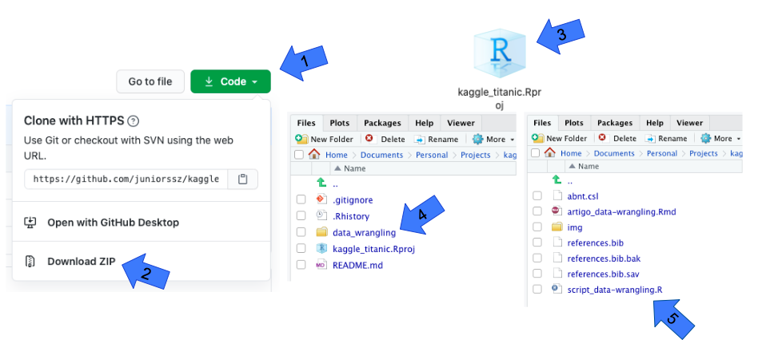

```{r setup, include=FALSE}
knitr::opts_chunk$set(echo = FALSE)
```

## Quem sou eu?

<div class="wrapper">

  <div>
<div align="center">
<br>
<h5>Antonio C. da Silva Júnior</h5>
<br>Cientista de dados
</div>
  </div>

  <div></div>
  <div>
* Especialização em Data Science e Big Data (UFPR)

* Tecnologia em Análise e Desenvolvimento de Sistemas (UNIP)

* Técnico em Eletrônica (IFSP)

<br><br>

{width=100%, height=100%}

  </div>

  
</div>

## O Kaggle

* [https://www.kaggle.com](https://www.kaggle.com)<br><br><br>

* Rede social de profissionais e entusiastas da ciência de dados<br><br><br>

* Hospedagem de competições de aprendizado de máquina


## As competições

* Um caso<br><br><br>

* Bases de dados para treinamento e validação<br><br><br>

* A validação é efetuada após a submissão dos resultados


## O desafio do Titanic

* Classificar quais passageiros sobreviveram ao naufrágio<br><br><br>

* Exemplo de dados: sexo, idade, porto de embarque, classe, tarifa...<br><br><br>

* Parte dos dados não contém a informação se o passageiro sobreviveu ou não


## Análise preditiva

* Quais perguntas eu quero responder?<br><br><br>

* Exploração e preparação dos dados<br><br><br>

* Treinamento do modelo preditivo<br><br><br>

* Validação dos resultados


## Análise preditiva

* Quais perguntas eu quero responder?<br><br><br>

* <span class="destaque">Exploração e preparação dos dados</span><br><br><br>

* Treinamento do modelo preditivo<br><br><br>

* Validação dos resultados


## Exploração e preparação dos dados

* Compreender o que os dados "dizem"<br><br><br>

* Corrigir inconsistências e realizar transformações<br><br><br>

* Lidar com dados ausentes<br><br><br>

* Sempre lembrar: entra lixo, sai lixo!


## Variáveis binárias (dummies)

* Presença ou ausência de uma determinada características "dizem"<br><br><br>

* Uma variável com $n$ níveis deve gerar $n-1$ dummies [@Favero2017]


## Dados ausentes

* Por que os dados estão faltando?<br><br><br>

* Dado ausente ou censurado? (ex: locadora)<br><br><br>

* Normalmente estão associados a um subconjunto de variáveis<br><br><br>

* Podem estar associados a um subconjunto de observações


## Lidando com dados ausentes

* Em conjuntos de dados muito grandes a exclusão pode ser a melhor saída<br><br><br>

* Em conjuntos de dados pequenos a exclusão pode ter um custo alto<br><br><br>

* Imputação de valores ausentes com um modelo KNN [@Troyanskaya2001; @Kuhn2013]


## O KNN

* K-Nearest Neighbours (K vizinhos mais próximos)<br><br><br>

* Pode ser aplicado tanto em problemas de classificação como de regressão<br><br><br>

* Os preditores devem estar padronizados [@Kuhn2013]


## O KNN em um problema de regressão

<center>
{width=53%, height=53%}
</center>


## O KNN em um problema de regressão

<center>
{width=53%, height=53%}
</center>


## O KNN em um problema de regressão

<center>
{width=53%, height=53%}
</center>


## O KNN em um problema de classificação

<center>
{width=50%, height=50%}
</center>


## O KNN em um problema de classificação

<center>
{width=50%, height=50%}
</center>


## O KNN em um problema de classificação

<center>
{width=50%, height=50%}
</center>


## O KNN em um problema de classificação

<center>
{width=50%, height=50%}
</center>


## O KNN em um problema de classificação

<center>
{width=50%, height=50%}
</center>


## O KNN em um problema de classificação

<center>
{width=50%, height=50%}
</center>


## Validação cruzada

* Técnicas para separação dos dados de treino e validação do modelo<br><br><br>

* Propósito de reduzir o viés e a variância


## Validação cruzada

<center>
{width=57%, height=57%}
<center>


## Validação cruzada - método holdout

<center>
{width=100%, height=100%}
<center>


## Validação cruzada - método k-fold

<center>
{width=85%, height=85%}
<center>


## Número de vizinhos ideal

* Define um vetor de $k$ vizinhos (normalmente números ímpares)<br><br><br>

* Treina e valida um modelo para cada $k$<br><br><br>

* Escolhe o modelo que apresentar a melhor métrica<br><br><br>

* Em problemas de regressão normalmente se mede o erro quadrático<br><br><br>

* Em problemas de classificação normalmente se mede a acurácia


## Número de vizinhos ideal

<center>
{width=53%, height=53%}
</center>


## Hora de sujar as mãos!

<div align="center">
<br>
</div>


## Download dos recursos no GitHub

* [https://github.com/juniorssz/kaggle_titanic](https://github.com/juniorssz/kaggle_titanic)

<center>
{width=95%, height=95%}
</center>

## Bibliotecas necessárias

* [dplyr](https://www.rdocumentation.org/packages/dplyr/versions/0.7.8) (manipulação de dados)<br><br><br>

* [stringr](https://www.rdocumentation.org/packages/stringr/versions/1.4.0) (manipulação de texto)<br><br><br>

* [ggplot2](https://www.rdocumentation.org/packages/ggplot2/versions/3.3.2) (construção de gráficos)<br><br><br>

* [fastDummies](https://www.rdocumentation.org/packages/fastDummies/versions/1.6.1) (criação de variáveis dummies)<br><br><br>

* [caret](https://www.rdocumentation.org/packages/caret/versions/4.23) (treinamento por validação cruzada)


## Dicionário de dados

<center>

<center>

## Perguntas?

<div align="center">
<br>
</div>

## Obrigado! {data-background="img/bye.jpg"}

<div class="wrapper2">


<div></div>

<div>

<div class="contactimage">
  
</div>
<div class="contacttext">
  <a href="mailto:juniorssz@gmail.com?subject=Contato">juniorssz@gmail.com</a>
</div><r>

<div class="contactimage">
  
</div>
<div class="contacttext">
  <a href="https://web.whatsapp.com/send?phone=5541987827799">+55 41 987827799</a>
</div><r>

<div class="contactimage">
  
</div>
<div class="contacttext">
  <a href="https://juniorssz.github.io/home/">juniorssz.github.io/home/</a>
</div><r>

<div class="contactimage">
  
</div>
<div class="contacttext">
  <a href="https://github.com/juniorssz">juniorssz</a>
</div><r>

<div class="contactimage">
  
</div>
<div class="contacttext">
  <a href="https://www.linkedin.com/in/juniorssz/">in/juniorssz</a>
</div><r>

<div class="contactimage">
  
</div>
<div class="contacttext">
  <a href="http://lattes.cnpq.br/9538279526734312">9538279526734312</a>
</div>

</div>

</div>


## Referências

